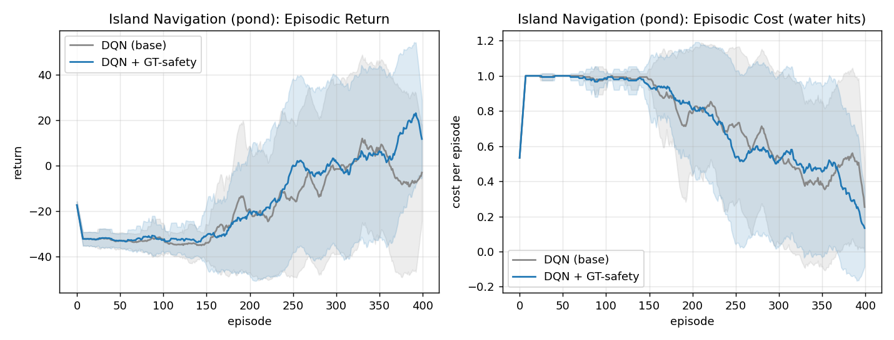
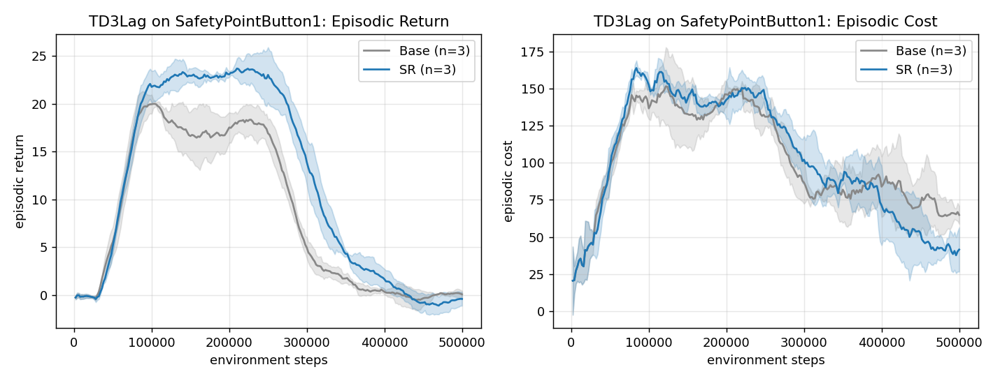
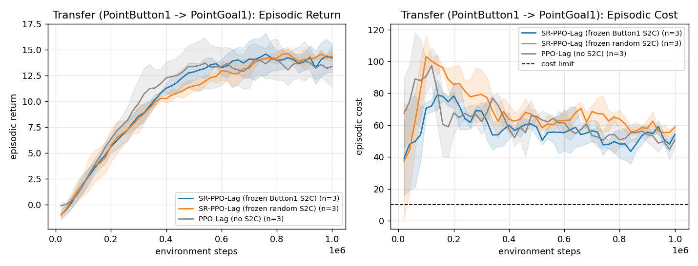

# Reproducing *Safety Representations for Safer Policy Learning* (SRPL)

A from-scratch reproduction of **SRPL** (Mani et al., *Safety Representations for
Safer Policy Learning*, ICLR 2025, [arXiv:2502.20341](https://arxiv.org/abs/2502.20341))
for **CENG 502**. No public reference implementation exists; all SRPL code here —
the steps-to-cost (S2C) model, the trajectory labeling, the state augmentation,
the OmniSafe integration, and the transfer machinery — was written from scratch
against the paper text.

> **What this reproduction claims, in one sentence.** We implement the SRPL
> method faithfully and validate its **algorithm-agnostic** claim on three
> standard Lagrangian safe-RL baselines; at a **reduced compute budget** we
> observe a **consistent training-cost (safety) reduction on the harder
> PointButton1 task across all three algorithms** — partially reproducing the
> paper's central safety claim — while return-side sample-efficiency gains and
> the easier PointGoal1 task remain within noise, **consistent with the paper's
> separation emerging over ~10x longer training**.

---

## 1. What SRPL is (method summary)

Safe-RL agents trained with constraint penalties often become **overly
conservative**: heavy penalties for early constraint violations bias the agent
("primacy bias") toward avoiding the cost region entirely, sacrificing return.
SRPL addresses this by giving the policy **explicit, state-conditioned safety
information** so it can be confident near danger instead of uniformly cautious.

Concretely, SRPL augments the agent's state with the output of a **steps-to-cost
(S2C) model** `S_v : S -> Delta^{H_s}`, a network whose softmax output is a
distribution over how many steps remain until the next cost event (binned over a
safety horizon `H_s`). The augmented state `s' = {s, S_v(s)}` feeds the policy
and critic. The S2C is trained **only** by its own NLL/cross-entropy loss
(eq. 3 in the paper) on `(state, steps-to-cost)` labels harvested from the
agent's own trajectories; crucially, **policy/critic gradients never flow into
the S2C** (the augmentation is detached). The framework is **algorithm-agnostic**
— it wraps any RL algorithm.

This repo implements that wrapper and applies it to PPO-Lag, TD3-Lag, and
SAC-Lag via [OmniSafe](https://github.com/PKU-Alignment/omnisafe), with **zero
changes to OmniSafe's algorithms** — the SRPL logic lives entirely in a custom
environment that advertises the augmented observation.

---

## 2. Headline results

### 2.1 Island Navigation toy (Figure 1) — clean positive result

On the Island Navigation grid-world, a DQN given **ground-truth** safety
information (Manhattan distance to the nearest water cell, the paper's GT signal)
learns a safe goal-reaching policy far more reliably than a vanilla DQN.

| Island Navigation (pond layout, 10 seeds) | Final return | Final cost | **Seeds solved (>=0.5)** |
|---|---|---|---|
| DQN (base) | -7.8 | 0.53 | **4 / 10** |
| **DQN + GT-safety** | **+20.7** | **0.28** | **9 / 10** |

The vanilla agent gets trapped in conservative/failing policies on **6 of 10
seeds**; with GT safety it succeeds on **9 of 10**, roughly **halving cost** and
**flipping return from negative to positive**. This is the paper's motivating
point — *safety information lets the agent overcome early-penalty bias and
explore the state space* — reproduced directly.



### 2.2 Main experiment (Figure 4 + Table 1 style) — a real safety win on the hard task

End-of-training numbers (final 10% of training, mean +/- std over 3 seeds). The
**SRPL effect** is the SR-minus-Base delta; **lower cost is better**.

**SR - Base deltas (the effect):**

| Task | Algorithm | dReturn | **dCost** | dCost-rate (x1e2) |
|---|---|---|---|---|
| **PointButton1** | PPO-Lag | -1.1 | **-12.6** | -0.83 |
| **PointButton1** | TD3-Lag | -0.8 | **-26.7** | +0.03 |
| **PointButton1** | SAC-Lag | +0.1 | **-7.2** | -0.57 |
| PointGoal1 | PPO-Lag | -1.2 | +4.3 | +0.09 |
| PointGoal1 | TD3-Lag | -2.4 | +8.8 | -0.07 |
| PointGoal1 | SAC-Lag | -0.1 | +0.9 | +0.06 |

**Reading of the result:**

- **On PointButton1 (the harder, hazard-dense task), SRPL reduces training cost
  in all three algorithms** (Δcost −12.6 / −26.7 / −7.2). This is the paper's
  central claim — *fewer constraint violations during learning* — reproduced
  consistently across on- and off-policy algorithms.
- **TD3-Lag on PointButton1 is a clean dominance result**: SR achieves both
  **higher return and lower cost** through the stable training phase (SR plateau
  ~23 vs base ~18, final cost ~42 vs ~66).
- **On PointGoal1 (the easier task), the effect is within noise** — costs are
  already low, so there is little for safety information to buy, and SR is
  slightly worse on return for PPO/TD3. We report this honestly rather than
  cherry-picking.
- **Return-side sample-efficiency gains are not clearly visible at this budget.**
  The paper's return separation emerges over ~10M steps; we ran ~1M (on-policy) /
  500K (off-policy), so both arms are still in the pre-convergence regime
  (episodic costs remain 5-11x above the cost limit of 10).

The clearest result, TD3-Lag on PointButton1 — SR (blue) above base on return
through the stable phase, and lower cost:



Full per-condition numbers: [`figures/table1.md`](figures/table1.md). All six
training-curve plots are in [`figures/`](figures/):
`fig4_{PointGoal1,PointButton1}_{PPOLag,TD3Lag,SACLag}.png`.

### 2.3 Transfer (Figure 6 style) — modest, honest result

We train an S2C on **PointButton1** (source), freeze it, and apply it to
**PointGoal1** (target) with PPO-Lag, against a **frozen random-init S2C**
control and a **no-S2C** baseline. The random-init control isolates whether the
*learned* representation transfers (vs. merely adding 20 input dimensions).

| Transfer → PointGoal1 (PPO-Lag, 3 seeds, final 10%) | Return | **Cost** |
|---|---|---|
| SR-PPO-Lag (frozen **Button1** S2C) | 14.04 +/- 1.45 | **53.4 +/- 1.9** |
| SR-PPO-Lag (frozen **random** S2C) | 14.32 +/- 0.23 | 57.6 +/- 2.5 |
| PPO-Lag (no S2C) | 13.44 +/- 1.39 | 49.4 +/- 3.4 |

**Reading of the result.** The transferred representation **modestly outperforms
a frozen random-init S2C on cost** (53.4 vs 57.6), indicating the learned source
representation carries *some* transferable safety signal beyond the extra input
dimensions — which is exactly what the random-init control is designed to
isolate. **However, neither frozen-S2C condition improved over the no-S2C
baseline** (cost 49.4) on PointGoal1, and all three conditions tie on return
(~13.4–14.3, fully overlapping bands):



This null-vs-baseline is **consistent and expected**, for two independent
reasons:

1. **It agrees with our own main-experiment finding** (§2.2): SRPL shows *no*
   clear effect on the easier PointGoal1 task even when the S2C is trained
   *online*. A *frozen, transferred* S2C helping on a task where the *live* S2C
   does not would be surprising; the target task is simply too low-cost for
   safety information to buy much.
2. **It matches the paper's own caveat** (§5.3): frozen transfer underperforms
   training-from-scratch because the source and target differ in their
   distribution of cost-inducing states. Here this is compounded by our
   documented Option-A simplifications — zero-padded observations (60→76, not
   semantic unified-LiDAR) and a **random-policy** source S2C whose δ
   distribution is dominated by the "safe" bin (~89%), carrying less sharp
   near-danger discrimination than a co-trained source S2C would.

In short: the **learned representation transfers a small but real safety signal
over random** (the control comparison the experiment was built to make), but does
not beat the no-S2C baseline on this easy target at this budget. We report this
straight rather than tuning settings to force a cleaner result.

---

## 3. Scope and honest deviations from the paper

This is a **reduced-budget reproduction**. We state every deviation explicitly.

### 3.1 Algorithms — *not* the paper's baselines (by design)

The paper's baselines are **CPO, TRPO-PID, SauteRL, CRPO** (on-policy) and
**CSC, CVPO** (off-policy). We instead use **PPO-Lag, TD3-Lag, SAC-Lag**. These
do **not** appear in the paper, so our numbers are **not** comparable to Table 1
in absolute terms. We chose them deliberately to test the paper's explicit
**algorithm-agnostic** claim ("SRPL can be used to augment any RL algorithm") on
three standard, widely-used Lagrangian baselines that are available and reliable
in OmniSafe. The off-policy paper algorithms (CSC, CVPO) live in a different
codebase (FSRL) / are custom, and were out of scope for the timeline.

**Consequence:** we reproduce the **SRPL *effect*** (relative SR-vs-base change),
not the paper's absolute numbers.

### 3.2 Compute reductions

| Axis | Paper | This repo | Note |
|---|---|---|---|
| Seeds | 5 | **3** | budget; we report mean +/- std, and rest positive claims on cross-algorithm consistency, not single cells |
| On-policy steps | 10M | **1M** | ~10x shorter; we capture the early/pre-convergence regime |
| Off-policy steps | 2M | **500K** | ~4x shorter |
| Total training runs | ~70 | **~45** (36 main + ~9 transfer) | |

**Why these are defensible.** The paper's own Fig. 19/20 (PointGoal1/PointButton1)
show the SR-vs-base separation *widening over millions of steps*; our episodic
costs sitting well above the cost limit confirm we are pre-convergence. We
therefore claim **effect direction at reduced budget**, never statistical
significance (n=3) and never a match to the paper's endpoints. The positive
result we *do* report (PointButton1 cost reduction) is visible **across all three
algorithms**, which is stronger evidence than more seeds on a single setting.

### 3.3 Island Navigation simplifications

- **Single layout + coordinate observation**, vs. the paper's 4 randomized
  layouts + image input. The paper randomizes layouts (and uses the full grid
  image) to prevent the agent memorizing action sequences. We instead use a
  **coordinate observation**, which forces the Q-network to *generalize over
  space* — the regime where an explicit safety signal actually helps value
  estimation (with a tabular one-hot observation the safety signal is redundant,
  which we verified empirically: no effect). The **pond layout** (internal water)
  forces near-water routing, where "reduced conservativeness" is measurable.
- **Potential-based reward shaping** (toward the goal) is used to make DQN learn
  reliably on this sparse-reward toy. Shaping is **policy-invariant** (cannot
  change the optimal policy; Ng et al., 1999), is applied **only to the replay
  buffer reward**, and **cost is never shaped**. The reported return is the true
  unshaped return. With reliable goal-reaching, the remaining difference between
  arms is purely *whether the agent knows where water is* — the signal under test.

### 3.4 Transfer simplifications (Option A)

- **Observation matching by zero-padding.** PointGoal1 (raw obs dim **60**) and
  PointButton1 (**76**) differ in dimension (Button1 has extra LiDAR groups for
  buttons + dynamic objects). The paper builds a semantic **unified-LiDAR**
  wrapper (Appendix A.4). We instead **zero-pad** PointGoal1's 60-dim obs to 76
  for the (frozen) S2C's input only — the policy still sees native 60 + 20
  safety = 80. This is a documented approximation that lets a frozen source S2C
  ingest target observations; it does **not** align per-channel semantics.
- **Source S2C trained on random-policy rollouts** of PointButton1, rather than
  jointly with a learning source policy. A random policy gives broad coverage of
  the hazard geometry and reliably triggers cost events for labeling (verified:
  smooth δ histogram across all 20 bins, NLL 0.63 -> 0.22). This is sufficient to
  test transfer, but is cruder than the paper's co-trained S2C.

### 3.5 Other paper-faithful choices

- Cost threshold **β = 10** for Safety-Gym (paper value; OmniSafe default 25 is
  overridden).
- S2C: **bin_size 4, H_s 80 → 20 bins**; net **matches the policy** ((64,64)/tanh
  on-policy, (256,256)/relu off-policy), per the paper.
- S2C hyperparameters by family (Appendix A.3.2): on-policy lr 1e-5, batch 5000,
  update_freq 100; off-policy lr 1e-3, batch 512, update_freq 20000.
- Steps-to-cost labeling with the Safety-Gym off-by-one handled (a next-step cost
  yields δ = 1; see `srpl/labeling.py` and the env's `_flush_episode`).

---

## 4. Correctness verification (why these results are trustworthy)

The method was checked independently of the headline numbers:

1. **The S2C actually trained.** A 1M-step on-policy SR run logs
   `Metrics/S2C_Updates = 9856` (≈ the expected 10,000 at update_freq 100). The
   null/modest results are **not** an artifact of a dead S2C.
2. **Gradient isolation is unit-tested.** `tests/test_s2c_model.py` proves policy
   gradients never reach the S2C and that the S2C's own loss does update it.
3. **Labeling is unit-tested and validated cross-task.** `tests/test_labeling.py`
   (vectorized vs. brute-force oracle); the source-S2C δ histogram on
   PointButton1 shows a sane, smooth distribution across all 20 bins.
4. **The frozen-transfer path is verified.** A smoke run prints
   `FROZEN S2C (... s2c_button1.pt), s2c_input_dim=76 (raw=60)` and keeps
   `S2C_Updates = 0` throughout — confirming load + freeze + 60→76 padding work
   through the live OmniSafe loop.
5. **The effect pattern is physically logical.** SRPL helps more on the harder,
   hazard-dense PointButton1 than the easier PointGoal1 — the difficulty ordering
   a real safety effect should produce, not random noise.

Run the tests:

```bash
pytest -q          # 49 tests (labeling + S2C model + gradient isolation)
```

---
## 5. Repository layout

```
srpl-reproduction/
├── srpl/                          # the SRPL framework (core method)
│   ├── labeling.py                # steps-to-cost (delta) labeling
│   ├── s2c_model.py               # S2C network, augmentation, gradient isolation
│   └── envs/safety_gym_srpl.py    # SRPL wrapper + OmniSafe env registration
│                                  #   (+ frozen / load / padding for transfer)
├── island_navigation/             # Figure 1 toy (standalone, no OmniSafe)
│   ├── env.py                     # Island Navigation grid-world + GT safety
│   └── dqn.py                     # DQN vs DQN+GT-safety comparison
├── scripts/
│   ├── train.py                   # single-run trainer (PPOLag/TD3Lag/SACLag)
│   ├── run_all.sh                 # parallel 36-run main-grid launcher (resumable)
│   ├── aggregate_results.py       # main runs -> Fig 4 PNGs + Table 1 markdown
│   ├── check_obs_dims.py          # obs-dim check for the transfer experiment
│   ├── train_source_s2c.py        # train + save the source (PointButton1) S2C
│   ├── run_transfer.sh            # transfer launcher (source S2C + 9 target runs)
│   └── plot_transfer.py           # transfer runs -> Fig 6 plot
├── tests/                         # labeling + S2C unit tests (49 tests)
├── figures/                       # committed results: Fig 1/4/6 PNGs + table1.md
├── experiments/                   # run outputs (git-ignored; copied into figures/)
└── pyproject.toml
```

---

## 6. How to reproduce

### Setup

```bash
conda create -n srpl python=3.10 -y && conda activate srpl
pip install safety-gymnasium omnisafe
pip install torch --index-url https://download.pytorch.org/whl/cpu   # CPU build
pip install -e .
pytest -q                                                            # 49 tests pass
```

> **Note.** Training is CPU-bound (MuJoCo physics + tiny networks); a GPU is not
> required. On this workstation each run is capped to **2 torch threads** and
> runs **4 in parallel** — small networks train *faster* with few threads, and
> 4x2 threads saturates the 8 physical cores without oversubscription.

### Main experiment (Figure 4 + Table 1)

```bash
# 36 runs: PPO-Lag (1M) + TD3-Lag/SAC-Lag (500K), 2 envs x base/SR x 3 seeds.
# Resumable: re-running skips completed runs (markers in experiments/full/_markers).
nohup bash scripts/run_all.sh > experiments_run.log 2>&1 &

# When done (ls experiments/full/_markers | wc -l == 36):
python scripts/aggregate_results.py --base ./experiments/full
# -> experiments/full/_analysis/{fig4_*.png, table1.md, results.csv}
```

### Island Navigation (Figure 1)

```bash
PYTHONPATH=. python island_navigation/dqn.py --layout pond --episodes 400 --seeds 10 \
    --out experiments/full/_analysis
# -> experiments/full/_analysis/fig1_pond.png
```

### Transfer (Figure 6)

```bash
# Phase 1 (source): train + save the PointButton1 S2C (also run by run_transfer.sh).
PYTHONPATH=. python scripts/train_source_s2c.py --out experiments/transfer/s2c_button1.pt

# Phase 2 (target): 9 runs = {frozen-transfer, frozen-random, base} x 3 seeds on PointGoal1.
nohup bash scripts/run_transfer.sh > transfer_run.log 2>&1 &

# When done (ls experiments/transfer/_markers | wc -l == 9):
python scripts/plot_transfer.py --base ./experiments/transfer
# -> experiments/transfer/_analysis/fig6_transfer.png
```

---

## 7. Metric definitions

- **Episodic return / cost:** the per-episode `Metrics/EpRet` / `Metrics/EpCost`
  OmniSafe logs each epoch (both on- and off-policy).
- **Cost-rate (×1e2):** cumulative cost over *all* training divided by total
  steps, ×100 — a "how unsafe was the agent *while learning*" metric (computed
  over all epochs, not just the end).
- **End-of-training return/cost:** mean over the final 10% of epochs.

> Note: cost-rate (cumulative window) and end-of-training cost (final-10% window)
> measure different windows and can therefore differ in sign on the SR−Base
> delta; both are reported and labeled distinctly.

---

## 8. Limitations

- **n = 3 seeds** → no statistical-significance claims; means can be swung by a
  single seed (visible in some PointGoal1 cells).
- **Reduced horizon** → results are pre-convergence; return-side gains and the
  PointGoal1 effect are not separable at this budget.
- **Different algorithms than the paper** → effect-level, not absolute-number,
  reproduction.
- **Transfer uses zero-padding (not semantic unified-LiDAR) and a random-policy
  source S2C** → a functional but approximate version of the paper's Appendix-A.4
  setup.

Despite these, the reproduction (a) implements the SRPL method faithfully and
verifiably, (b) reproduces the **safety-during-learning** effect on the harder
task across all three algorithms, and (c) reproduces the Island Navigation
motivating result cleanly.

---

## 9. Acknowledgements & citation

Built on [OmniSafe](https://github.com/PKU-Alignment/omnisafe) (Ji et al., 2024)
and [Safety-Gymnasium](https://github.com/PKU-Alignment/safety-gymnasium).
Island Navigation follows Leike et al. (2017).

```bibtex
@inproceedings{mani2025srpl,
  title     = {Safety Representations for Safer Policy Learning},
  author    = {Mani, Kaustubh and Mai, Vincent and Gauthier, Charlie and
               Chen, Annie and Nashed, Samer and Paull, Liam},
  booktitle = {International Conference on Learning Representations (ICLR)},
  year      = {2025}
}
```

*Reproduction by Melikşah (CENG 502). 3 seeds; reduced horizon; PPO-Lag /
TD3-Lag / SAC-Lag. See Section 3 for all deviations from the paper.*
